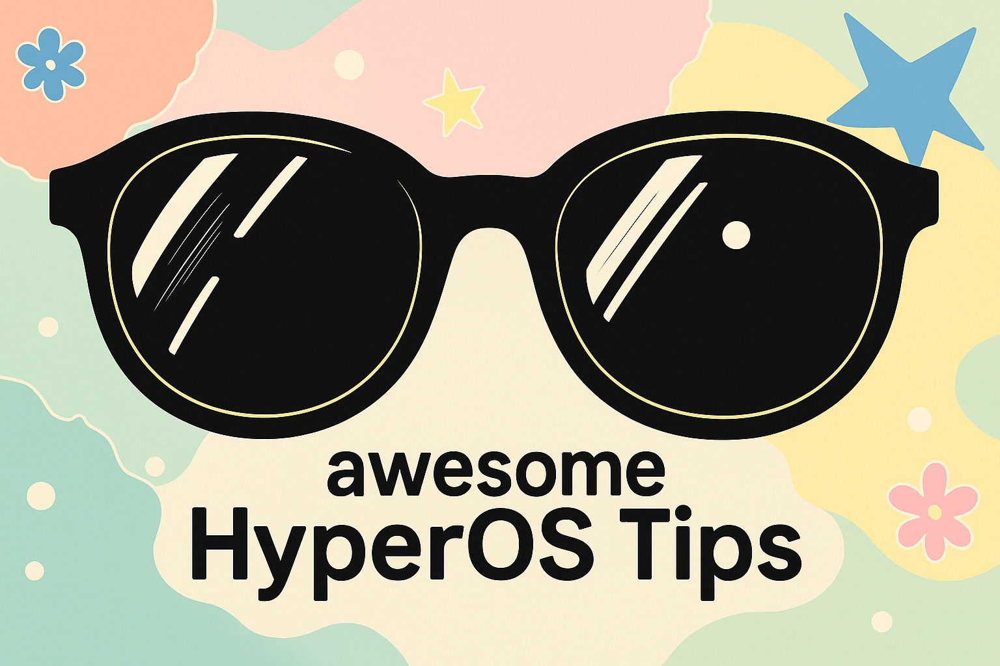

# 🕶️ Awesome HyperOS Tips 🏆 

HyperOS 使用小技巧分享，让 HyperOS 再次伟大！

## 广告

| 类型 | 方法                                                            | 备注               |
| ---- | --------------------------------------------------------------- | ------------------ |
| 应用 | 安装 [GKD](https://github.com/gkd-kit/gkd) 可跳过所有开屏广告。 | 安卓设备通用技巧。 |

## 锁屏

| 类型 | 方法                                         | 备注                       |
| ---- | -------------------------------------------- | -------------------------- |
| 操作 | 锁屏左滑可以进去控制中心打开闪光灯。         | 临时想用闪光灯不需要解锁。 |
| 设置 | 可以设置锁屏时可下拉操作，可以加上控制中心。 |                            |

## 应用

| 类型 | 方法                           | 备注               |
| ---- | ------------------------------ | ------------------ |
| 操作 | 网易云音乐可以配置状态栏歌词。 | 安卓设备通用技巧。 |

